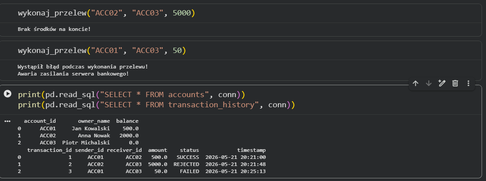
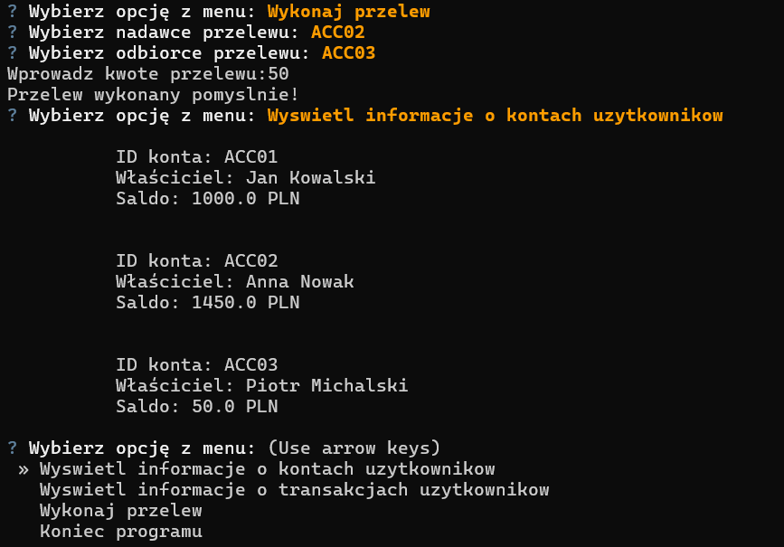

# Secure Transaction System

Aplikacja symulująca system przelewów międzykontowych z pełnym wsparciem dla mechanizmów transakcyjności SQL (ACID) oraz odpornością na awarie infrastruktury (`ROLLBACK`). Narzędzie zostało obudowane w interaktywne menu tekstowe CLI (`questionary`), oferując dynamiczne pobieranie danych z bazy, rygorystyczną walidację logiki biznesowej oraz automatyczne logowanie statusów transakcji (`SUCCESS`, `REJECTED`, `FAILED`).

## Podgląd działania programu

